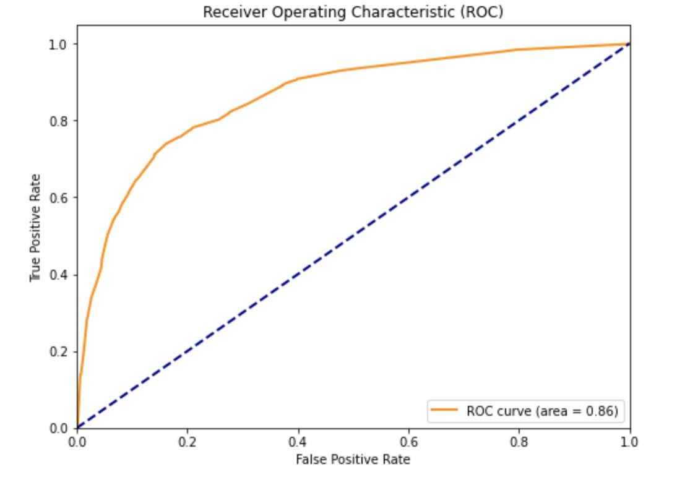
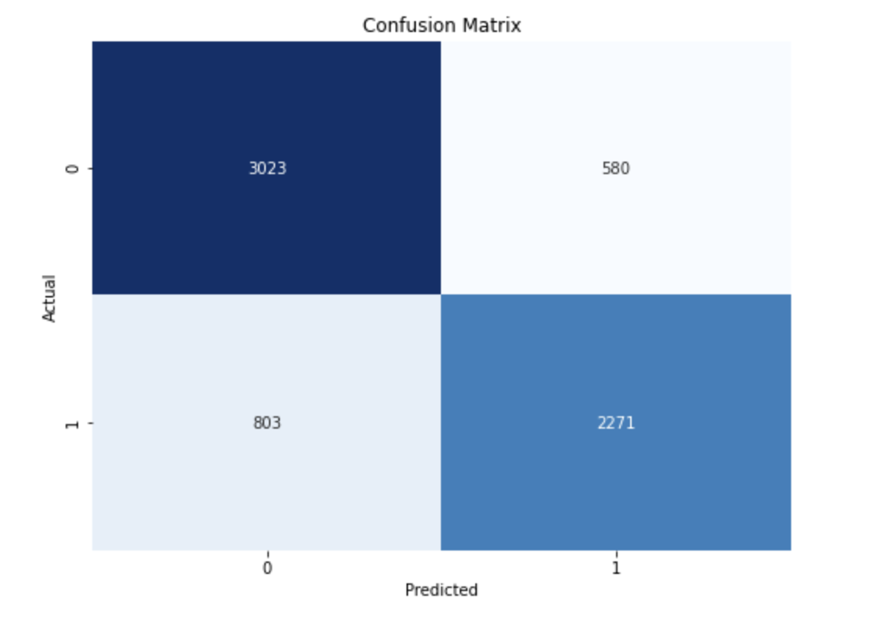
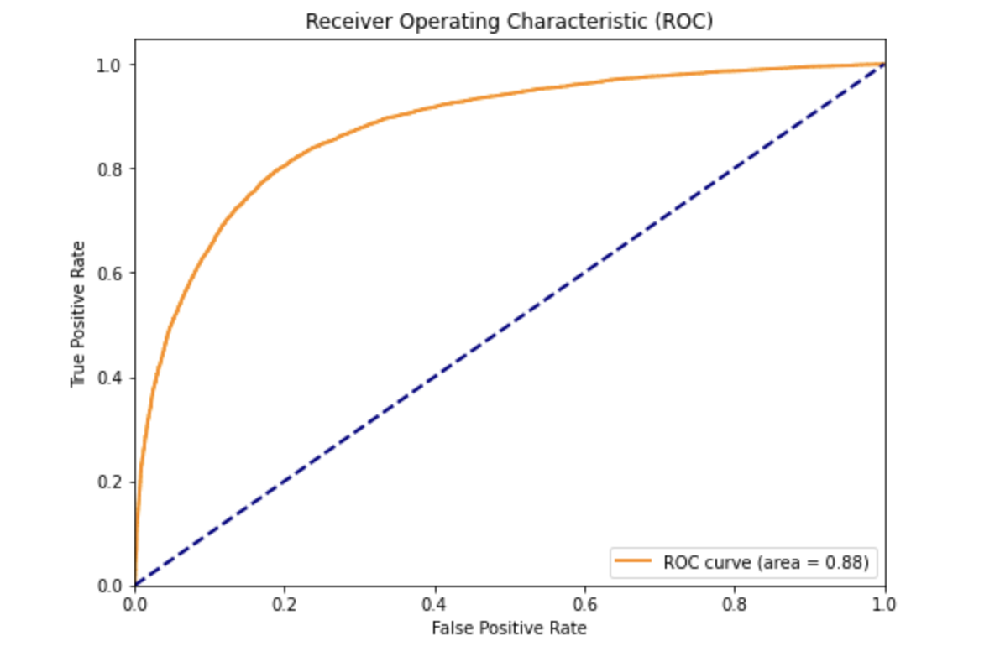
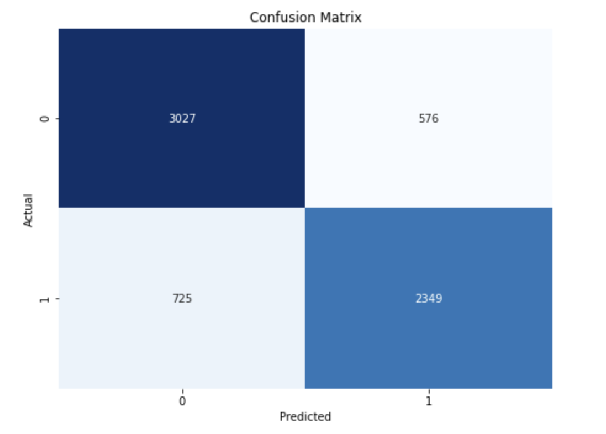
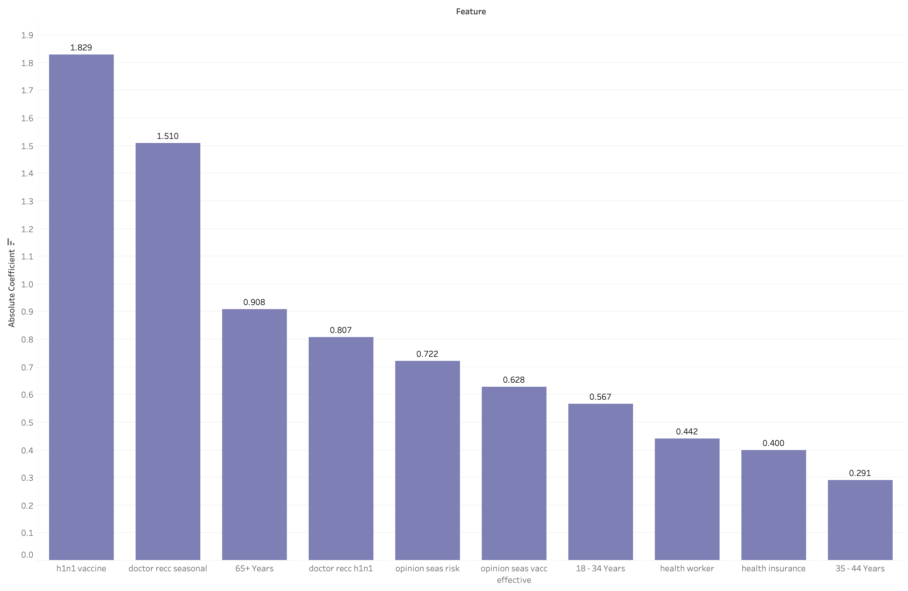
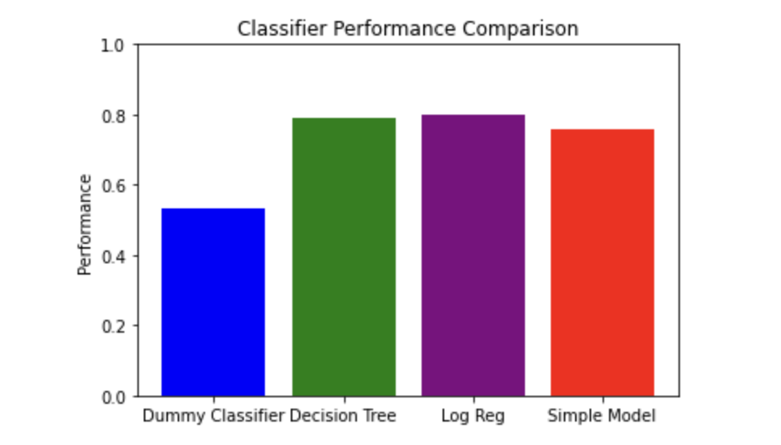

# Vaccines
## By Lydia Cuffman and Ramses Nestor Reis

  

Photo by <a href="https://unsplash.com/@cdc?utm_source=unsplash&utm_medium=referral&utm_content=creditCopyText">CDC</a> on <a href="https://unsplash.com/photos/GZkhG_EvWfY?utm_source=unsplash&utm_medium=referral&utm_content=creditCopyText">Unsplash</a>
 
GitHub Repository: https://github.com/ramses02/Vaccines
Presentation: 

### Overview 
Vaccines are a very important tool for the promotion of public health. They work best when most people get their vaccinations, leading to higher rates of group immunity and protecting those who cannot be immunized. Since vaccines are so valuable, it is useful to know whether a person is likely to pursue immunization.

### Business and Data Understanding
We have been tasked by a large healthcare organization to classify patients based on their seasonal flu shot status. In an overtaxed medical system, it is to the organization's advantage to minimize the number of flu cases. Obviously it is also to the benefit of the patients to not suffer from the flu and its possible serious consequences. By creating a model of whether a patient is likely to get their seasonal flu vaccine, we can help the organization focus efforts on reaching out to those patients who are less likely to get their shot. If the healthcare organization can vaccinate more patients, they can dedicate their finite resources to other important but perhaps less urgent needs.

### Modeling
We began by creating a dummy model that always predicts that a person did not receive their seasonal flu vaccine. This baseline estimator is right about 53% of the time.
We then created both a simple logistic regression and simple decision tree. Both handily improved on the performance of the baseline, much more accurately predicting a person's vaccination status. The decision tree was very overfit, so we ran a grid search to seek optimal parameters, ending with a model that provides 79.7% precision. The logistic regression was a bit underfit, so we also ran it through a grid search, improving a tad to a model with 80% precision.

Precision is the metric of choice for this analysis because our client would prefer false negatives to false positives. Encouraging an already immunized person to get a flu shot is less of an issue than assuming a patient will get theirs and then they don't. Promoting immunization is not cost-free; otherwise our dummy model would be the ideal. Our goal is a fitted precision: a good guess that errs on the side of negative.

### Decision Tree ROC:

### Decision Tree Confusion Matrix:

Note: False positive rate is 8.68%, considerably low for our target outcome.

### Logistic Regression ROC:

### Logistic Regression Confusion Matrix:

Note: False positive rate is 8.62%, considerably low for our target outcome.

In regards to the logistic regression, we identified the top 10 most significant aspects that impact our predictions on whether one will or will not receive a seasonal shot. These aspects include h1n1 vaccine status, doctor recommendation for seasonal shot, being older than 65, doctor recommendation for h1n1 shot, opinion on seasonal risk, opinion on vaccine effectiveness, behavioral aspects such as frequently washing hands, being between 18 and 34 years old, and being a health worker.

Features vs. Coefficients:

In addition to the final, complex logistic regression, we created another, simpler model that used features with high correlation coefficients to our target. Our simple model, using only four features, performs almost as well as our 36-feature complex model. We will present it to our client as an alternative for situations where extensive data collection may be cost-prohibitive or even impossible.

Classifier Performances:

### Evaluation
Our logistic regression outperforms our decision tree just slightly, but it does so by multiple measures. It has a higher precision score as well as overall accuracy score, and its ROC curve is slightly closer to ideal.

Our final model has a precision score of 80.3%. Our simple model is slightly less precise with a score of 78.4%.

### Recommendations
We offer our logistic regression model to help the healthcare organization predict whether a patient will get the seasonal flu shot.

We also offer a simplified model that achieves very similar results with only four inputs. Determining these four features about a patient is likely much more achievable than gathering 36 data points. The ease of making predictions about a patient may compensate for the slight loss of precision.

Given its high correlation with vaccine status, we also recommend that doctors make a regular practice of recommending the flu vaccine to their patients. It is the only feature in the model completely within the control of our client, and it has a strong relationship with patients getting immunized.

### Next Steps
The model can be improved going forward if our client keeps track of its efforts to promote vaccination. We can add a feature based on whether a patient received targeted encouragement, and see the effect that has on vaccine uptake. It seems likely that some people are unvaccinated due to hesitancy or personal conviction, while others simply don't put in the effort to make sure they get their shot every season. Teasing out the differences in those two groups may suggest further ways to categorize and effectively reach these potentially different groups.

### Repository Structure
├── data
├── images
├── working_notebooks
├── README.md
├── main_notebook.ipynb
├── presentation.pdf
├── .gitignore
└── LICENSE